# Git y Github (Comandos básicos)

Es importante tener instalado **Git** y una cuenta en **GitHub**, también un editor de texto (_VisualStudioCode o el que más le agrade utilizar_). A continuación se mostraran los comandos básicos para usar en un proyecto:  

# Git

* ## Git init

Este comando se usa solo una vez para iniciar un nuevo proyecto y tenerlo en un repositorio, donde se guarda todo lo que se realize. Para saber si ya se inicio, en el **directorio de trabajo**(*Working Directory*), se creará un carpeta llamada ".git" la cual estará oculta, es ahi donde se guardaran los cambios del proyecto.

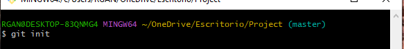

* ## Git add
El comando siguiente sirve para subir los archivos que se tienen en el **Working Directory** al **Stagin Area**(*área de preparación*), donde se mantienen temporalmente para después guardalos en el repositorio. 

Los archivos se pueden subir de diferentes formas, una es agregar un archivo especifico:

La otra opción es agregar todos los archivos:

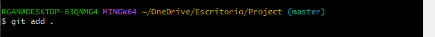

* ## Git status

Con este comando se puede ver el estado de los archivos, es decir, los que aun se encuentran en **Working Directory** (se muestra en color rojo el archivo que no ha sido subido) y los que estan en el **Staging Area** (es mostrado en color verde, indicando que se guardo el cambio), por ejemplo:

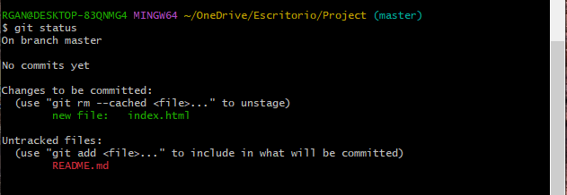

* ## Git commit

Se guarda o captura dentro del repositorio local los cambios realizados de los archivos, antes de realizar tal acción se debe hacer una configuracion del nombre y correo del usuario (con este ajuste ayuda a saber quien realizo los cambios). A continuacion se muestra un ejemplo:

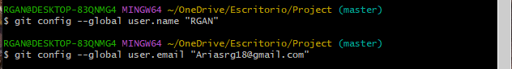

Después del ajuste, ya se puede guardar el cambio con el siguiente comando:

     git commit -m "Escribir un mensaje referente al cambio realizado"

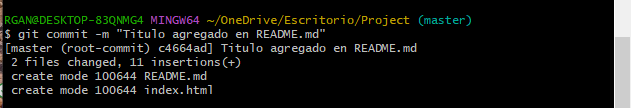

* ## Git log

Esta parte se encarga de mostrar en orden los cambios guardados en un repositorio. Se muestra un ejemplo:

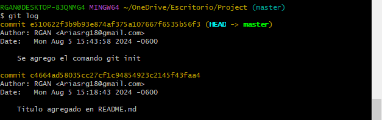

* ## Git branch

+ El comando se usa para mostrar cuantas ramas existen en el proyecto, ejemplo:

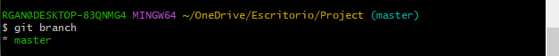

+ Para agregar una nueva rama, el comando es: *git branch + nombre de la versión* y luego para saber si se creo, se escribe nuevamente *git branch*.

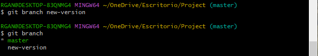

* ## Git checkout

El siguiente comando tomando en cuenta el anterior, sirve para cambiar de una rama a otra dentro del proyecto, escribiendo lo siguiente como ejemplo:

     git checkout new-version

+ También se utiliza para recuperar o consultar el archivo guardado en el repositorio, un ejemplo puede ser del archivo "index.html", en el cual se elimino lo que tenia y se agrego "Es un texto de prueba". Escribiendo el comando que se mostrara a continuación se recupera lo que *index.html* tenia anteriormente.

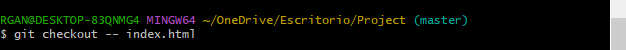

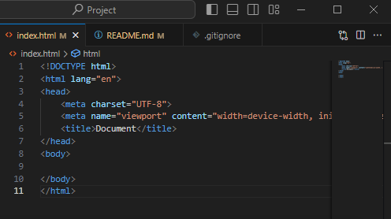

# Github

Aqui ya se utiliza *GitHub* para conectar el repositorio local con el repositorio remoto, por lo que primero se creará un nuevo repositorio, tal y como se muestra a continuación.

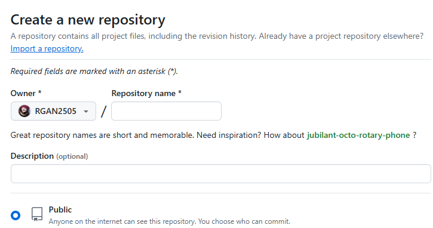

* ## Git remote

Realiza la conexión del repositorio a GitHub.  
Se copiara el siguiente comando *git remote* tal como se muestra abajo, para después ejecutarlo en la consola.

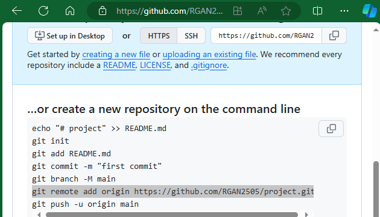

* ## Git push

Envia los commits locales al repositorio remoto, para ello se necesitan dos parametros: el repositorio remoto y la rama a la que corresponde el commit.
Ejemplo:

Ya que se ejecuto el comando, se mostrará una ventana emergente de *login* para poder conectar el repositorio local a GitHub, tal y como se muestra en la imagen. (No olvidar conceder los permisos necesarios).

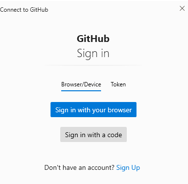

Después en la consola se mostrará que si se subio correctamente los archivos al repositorio remoto, como en la imagen.

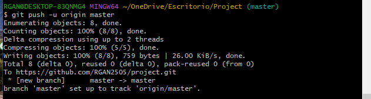

* ## Git pull

Ayuda a obtener la última versión del repositorio, ejecutando *git pull*, es decir, extrae los cambios realizados en el repositorio remoto al local.

* ## Git clone

Crea una copia de trabajo local del repositorio remoto existente. Para realizar la clonacion, se usa el siguiente comando en la consola: 

     git clone + (link copiado del proyecto en GitHub)

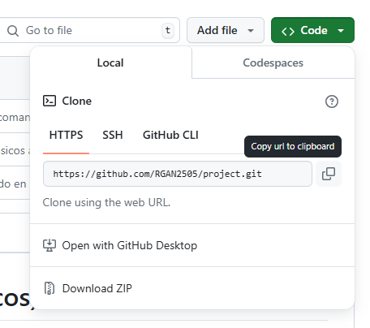

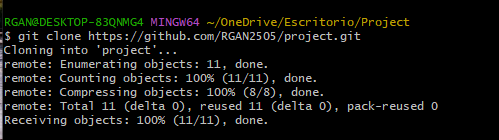

